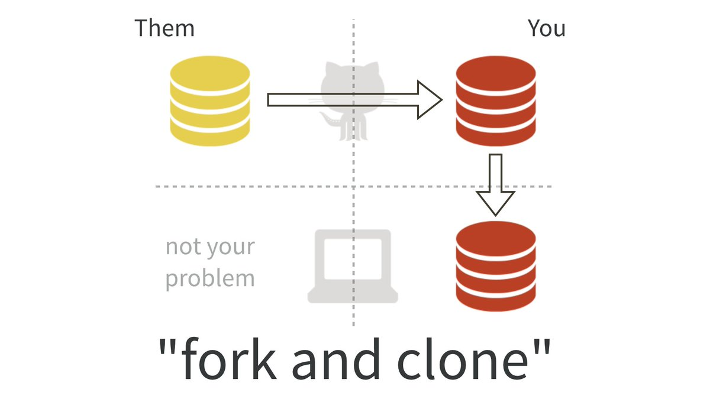
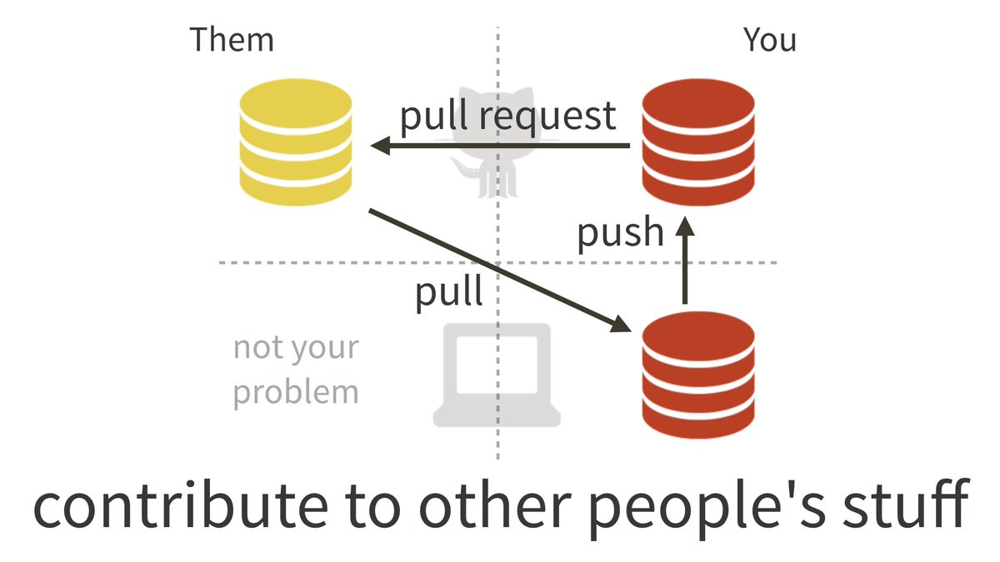

R Workshop: Git + R
===================

This is a workshop put together by Angela Li of the [Center for Spatial Data Science (CSDS)](https://spatial.uchicago.edu) at UChicago for the R Spatial study group. The emphasis is on developing a usable Git/Github + R workflow for researchers. More complicated topics have been skipped in the interest of getting people going ASAP.

Learning Objectives
-------------------

By the end of this workshop, workshop attendees should be able to:

1.  Install Git locally and confirm that they can push/pull from Github
2.  Create a repository on Github and clone it to their computer
3.  Push a change to Github
4.  Fork a repository, make an edit, and submit a pull request
5.  (If time) Use the command line in RStudio to do the same thing

⭐️ Do This Now! ⭐️
------------------

-   **Navigate to Github.** Log in to your [Github](https://github.com) account (you should have already created one).
-   **Navigate to Happy Git, ch. 13.** We're going to start with this \[book chapter\] by Jenny Bryan (<http://happygitwithr.com/rstudio-git-github.html>) - open this up and have it as a guide along the way.

Git Basics
----------

### Workflow - 1 person

1.  Make a repository on Github
2.  Clone the repository to your computer
3.  Make changes to files, bring changes to Git's attention
4.  Group related changes into a commit (a snapshot of your changes)
5.  Push changes to Github

### Workflow - collaboration

1.  **Fork someone's repository on Github**
2.  Clone your forked copy of their repository to your computer
3.  Make changes to files, bring changes to Git's attention
4.  Group related changes into a commit (a snapshot of your changes)
5.  Push changes to Github
6.  **Submit a pull request to the original owner**: "I made some changes to a copy of your work, do you want to take a look and see if you want to include my changes in the original?"

Resources
---------

-   [Happy Git + R](http://happygitwithr.com), the R user's guide to Github. Note that there are sections that are not completely up-to date. I use this mainly for troubleshooting working with RStudio and Git, and for checking my workflows.
-   [Software Carpentry](https://swcarpentry.github.io/git-novice/), an entire lesson on Git (focus is not on using it with R workflows), really good & comprehensive lesson on things.
-   [NEON tutorial on basic Git concepts, working from the command line](https://www.neonscience.org/github-git-add), has some good diagrams and schematics, as well as explanationa (again, focus is not on using it with R workflows).

Troubleshooting
---------------

To be updated during/after this workshop!

Contact Me
----------

Feel free to email me at <ali6@uchicago.edu> or reach out [on Slack](https://csds-uchicago.slack.com) or [on Twitter](https://twitter.com/CivicAngela) for questions! Or submit a Github Issue on this page for problems.
